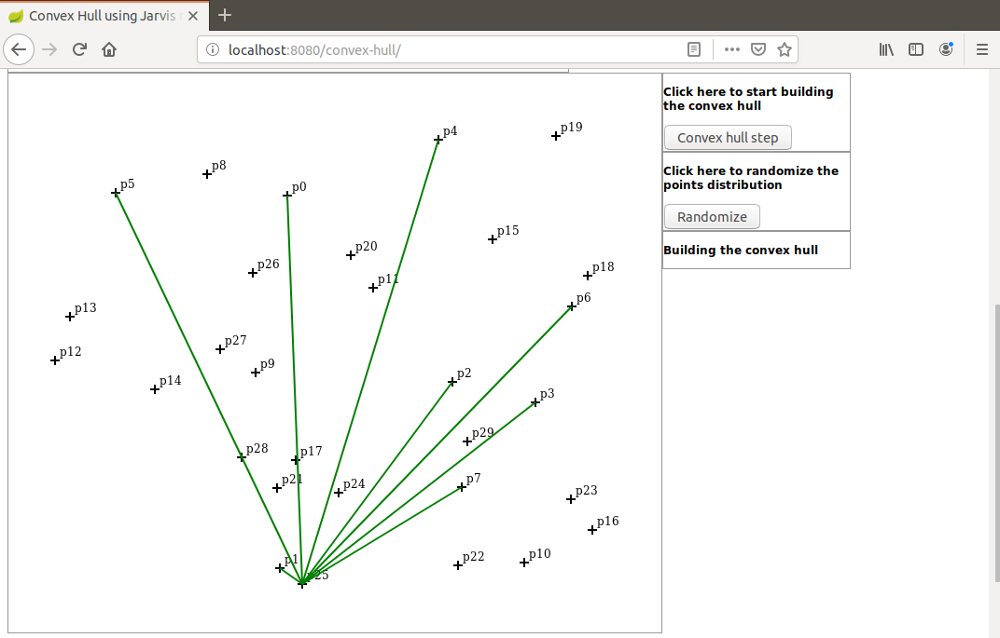

# jarvis-step
I present here a Java based step-by-step demonstration of the Jarvis Step algorithm applied to build the convex hull of a points distribution.

Only a recent Maven version is required to run this application (I used 3.6.0).

Javascript is used for display and initialization only. Here are the implementation details:

A random points distribution is created (browser side)

The distribution is sent to the server as a JSON object.

Then the Jarvis March is executed step-by-step (server side).

At each step the partial result is sent to the browser as a JSON object.

The partial result is used to update the display.

This implementation does not use any explicit angle. No trigonometric functions are used. Instead a cross product is used for all angle comparisons.

To launch the demo run the command:
```
mvn spring-boot:run
```
When the application has started open a browser and hit url `localhost:8080/convex-hull`

Here is a screen shot of a step:



For a demonstration of the Graham Scan algorithm please visit these repositories:

https://github.com/dubersfeld/graham-step

https://github.com/dubersfeld/graham-anim

Dominique Ubersfeld, Cachan, France
